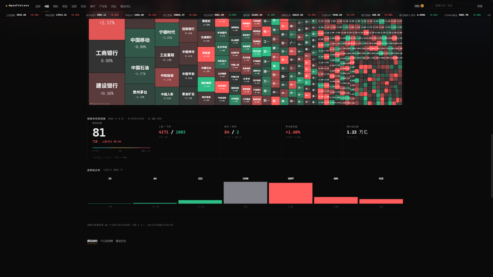
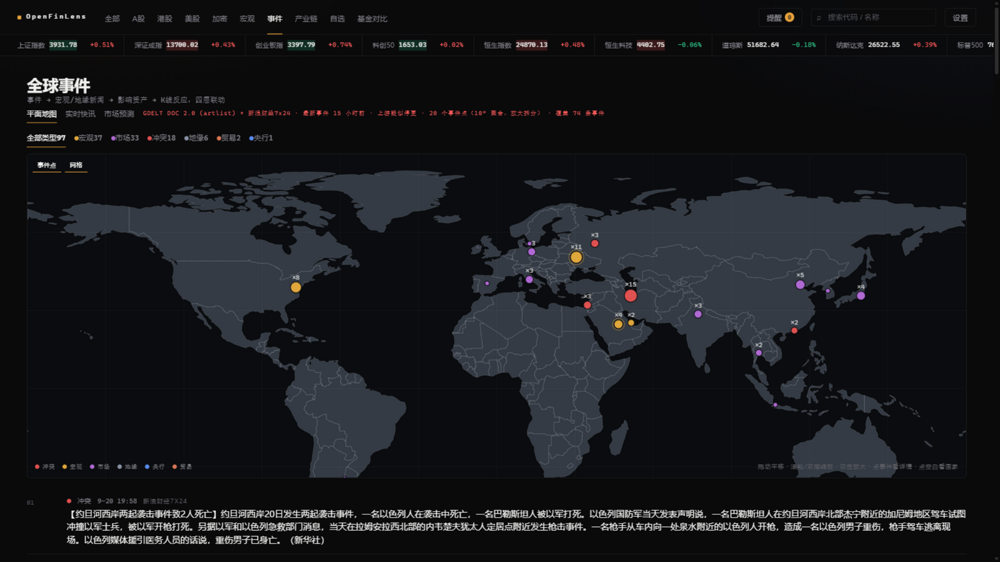

<div align="center">

# 🔭 OpenFinLens

**零依赖、零密钥、零服务器的全球金融看板。**
*A market dashboard with zero dependencies, zero API keys and zero backend — it lives in your browser.*

**[线上体验 · Live Demo →](https://5777-wq.github.io/openfinlens/)**




</div>

## 为什么有这个项目

想看一眼今天的行情，正常流程是这样的：打开行情软件，关掉弹窗，发现全市场热力图要开 VIP；想看龙虎榜，再开一个网站；想看南向资金，再开一个；全球出了什么大事，再来一个。四个标签页之间反复横跳之后，你悟出一个道理：**信息本来都是免费的，把信息凑到同一块屏幕上才收钱。**

凑到同一块屏幕上也有便宜的方案——Bloomberg Terminal，一年三万美元上下。

这个项目选了最笨也最省钱的路线：数据本来就在各家免费公开接口里躺着（腾讯、东财、币安、新浪、世界银行、GDELT……），那就直接在**你的浏览器里**把它们抓回来，拼成一块屏幕。没有服务器，没有数据库，没有构建步骤，也没有 `node_modules` 黑洞。克隆下来，双击 `index.html`，它就活了。

```
安装步骤：双击 index.html。就这。
```

## 快速开始

```bash
git clone https://github.com/5777-wq/openfinlens.git
cd openfinlens
# 方式一：直接双击 index.html（所有数据源 CORS 全通，file:// 也能跑）
# 方式二：起个本地服务器
python -m http.server 8765   # → http://127.0.0.1:8765
```

打开后先别乱点：在「全部」等两秒让热力图把 A股 5000 多只抓完，再去「事件」把地图拖两下、点一个圆点——这两个页面基本能说明这个项目在干什么。

## 事件地图



*GDELT + 新浪 7x24 每 5 分钟采集一次，地理定位后按类别落点；央行/宏观/贸易/冲突/选举/能源白名单过滤。Canvas 自绘等距圆柱投影，拖拽平移、滚轮缩放、悬停看事件、点聚合簇展开清单——不依赖任何地图服务，也就没有任何 key。*

## 都有什么

板块栏 10 个 tab：全部 / A股 / 港股 / 美股 / 加密 / 宏观 / 事件 / 产业链 / 自选 / 基金对比。宽屏 ≥1280px 自动两栏密排，10 秒轮询，红涨绿跌可切换。

**🗺️ 全市场热力图** —— A股 5000+ 只、港股 ~2900、美股 ~13800、加密 80 币，手写 squarify + Canvas。滚轮以光标为锚缩放、拖拽平移、双指捏合、右键复位。哪个板块涨疯了，一眼就知道。

**🎯 首屏** —— 全球核心指数卡（上证 / 纳指 / 标普 / 恒生，各带 60 日迷你走势 + 当日振幅条）、全球涨跌概览（N 涨 / N 跌 + 等权平均）、你的自选卡片墙。空自选时给引导文案，不整块消失。

**⚡ Event-on-Chart** —— 宏观/央行/贸易/冲突事件和龙虎榜按日期画上 K 线（圆点 marker），点一下弹出事件卡。让你亲眼看到「事件发生的第二天，价格是怎么反应的」，而不是听别人转述。

**💰 披露类资金** —— 只看监管要求披露的东西：龙虎榜 + 席位 90 天档案（A股 tab）、伯克希尔/桥水/ARK/Pershing 的 13F（美股 tab）、南向资金持股（港股 tab）、公开言论聚合（事件页）。发言 ≠ 交易，口径严格分开。

**🆚 基金对比** —— 最多 8 只标的扔进同一条时间轴：东财后复权价（**含分红再投资**）归一化曲线 + 总收益 / CAGR / 年化波动 / 最大回撤（含峰谷日期）/ 卡玛 / 夏普 + 自然年收益矩阵 + 相关性矩阵，最长回到 2006 年。改动的选择实时写进 hash，复制地址就是分享。数据源拿不到含分红口径时，会明确降级标注「价格收益」——绝不把价格收益糊弄成总收益。

**🧪 技术面 + 情绪** —— RSI(14) · MACD · KDJ · BOLL · ATR · 量比 · 均线排列，全部日K手算、附常用读法；各市场自己的温度计、涨跌家数、七段分布。全部是统计口径，一个「买入」都不会出现。

**🌍 世界经济仪表盘** —— 世界银行 API，美中日德英法印韩 × GDP / 增长 / 通胀 / 失业 / 债务 / 经常账户，列内色阶热图。

**📺 产业链 + 热门概念** —— 10 条链 · 49 个环节 · 163 只成分股（逐一实测过代码），环节强度 = 成分股涨跌幅实时均值；东财 500+ 概念板块实时榜，命中人工链条直接跳转，未命中展开领涨成分股兜底。

**⌨️ 藏在细节里的** —— 市场时段徽章（夏令时是对的）、hash 深链、键盘 1-9/0 切 tab、`/` 搜索（中文/代码/拼音）、`Backspace` 返回；`?crypto=off` 一键隐藏全部加密内容（微信小程序合规预留，界面无入口）。

## 它怎么工作

```
浏览器（纯客户端）
├── sources/  每类数据一个适配器，统一输出 Quote 结构
│     主源 ──失败──▶ 备源 ──失败──▶ localStorage 缓存（带时间戳）
├── app.js    轮询调度（setTimeout 链）→ 增量 patch DOM，不整墙重建
├── treemap/charts/technical/events/compare/spark  纯函数计算层，全部可单测
├── worldmap.js + bus.js  事件地图 ↔ K线 ↔ 资金，轻量事件总线联动
└── 永不白屏：任何一层挂掉都是「降级角标 + 旧数据/骨架」，绝无弹窗报错
```

海外源（GDELT / SEC EDGAR / Polymarket）**不在浏览器里请求**：`.github/workflows/collect.yml` 定时抓取、清洗、去重、地理定位后提交一份静态 JSON，浏览器只读自己的数据——所以你不需要能直连海外接口，这个看板照样能跑。Polymarket 每 30 分钟采一次，**只提取「事件发生概率」一个数字**，产物不含任何平台链接与交易入口。

一个诚实的警告：GitHub 对免费仓库的 schedule 高负载时延迟严重（实测 `*/5` 被拖成 4~6 小时一次）。要保证事件新鲜度，把采集搬到自己的服务器：见 [docs/SERVER-COLLECT.md](docs/SERVER-COLLECT.md)（cron 每 2 分钟，端到端 2~5 分钟）。

## 数据源 · 全部免密钥

| 品类 | 主源 | 备源 | 兜底 |
|---|---|---|---|
| A股 / 港股 / 美股 / 全球指数 | 腾讯 `qt.gtimg.cn`（GBK） | 东财 `push2delay` | 缓存 |
| A股全市场（热力图/宽度） | 东财 `clist` 分页并发 | 腾讯精选 | 缓存 |
| 港股全市场 | 东财 `m:116+t:3,t:4`（正股 ~2900 只） | — | 缓存 5min |
| 美股全市场 | 东财 `m:105,106,107`（全量 ~13800 只） | — | 缓存 5min |
| 加密 | 币安 `data-api.binance.vision` | OKX | 缓存 |
| 外汇 / 商品 / 国债收益率 | 东财 secid | 新浪（需代理） | 缓存 |
| K线 / 分时 | 腾讯 `ifzq`（前复权） | 东财 → 空态 | 不白屏 |
| 基金对比长历史 | 东财 `push2his`（后复权含分红，2006 至今） | 腾讯不复权（标注「价格收益」） | 空态 + 熔断 |
| 概念榜 / 龙虎榜 / 南向持股 | 东财（CORS 直连） | — | 空态 |
| 全球事件 | GDELT + 新浪 7x24 → Actions 采集 → 静态 JSON | 缓存 | 空态 |
| 市场预测（事件概率） | Polymarket Gamma → Actions 每 30 分钟（只取概率，无链接） | 缓存 | 空态 |
| 机构持仓 13F | SEC EDGAR → Actions 每 6 小时（四机构，滞后 34~45 天） | 缓存 | 空态 |
| 新闻 | 新浪 roll（JSONP） | 东财 | 缓存 60s |
| 宏观年度指标 | 世界银行 | — | 缓存 24h |
| 搜索 | 东财 searchapi（中文/代码） | codetable（拼音） | 空态 |

## 踩坑实录

下面这些坑全是逐个接口 curl 出来的，有的还踩过两次——因为第一版的结论被我自己的复测推翻了。它们本可以是我失去的两天，现在是你的二十分钟：

- 东财 `push2his` 直连**带 CORS**，5000 根以内能取满，最长回到 2006 年；`push2delay` **不存历史 K 线**（`klines` 恒空）——所以外汇/商品的日K至今没有免费直连源，详情页对这些品类诚实显示空态。
- 东财长历史必须 `fqt=2`（后复权）：它的 `fqt=1` 前复权是「减去累计分红」的**加性**口径，长窗口会算出**负价格**（实测长江电力最小收盘 −7.58 元——一家伟大的公司，股价是负的），收益比值直接变负。后复权是乘性口径，与美股前复权同比值（SPY/QQQ 两口径比值完全一致）。
- 同理，腾讯的 `qfq` 也一律不能当「含分红」用：拿它的比值当总收益，会把长江电力 2010 至今算成 **+9324% / 年化 46.8%**（真值约 +317% / 12.8%）。兜底源只算价格收益、界面必须标注，且不做 `fqt=1` 重试。
- 东财 WAF 会按 IP 封短时间大量长历史请求（实测整段 `other side closed`，持续十几分钟）。对策：请求按需分档、并发限 3、失败进指数退避熔断，熔断期间自动走腾讯兜底并在界面标明口径。「重新取数」按钮带 `fresh` 参数绕过缓存——否则 6 小时缓存会记住兜底结果，按钮成了摆设。直连被墙时可部署 `worker.js`（Cloudflare Worker 代理）作为逃生口。
- 腾讯兜底走不复权 `/appstock/app/kline/kline` 而不是 `fqkline`：除了口径，深度反而更好（A股周线 1084 根回到 2003 vs 640 根）。`fqkline` 现在对 Node/curl 回 501 + JS 挑战页（真实浏览器会自动过，线上无感，但 Node 直连测试会红——是环境问题，不是功能坏了）。
- 6 位 A股代码的市场位**按号段定死**，不能靠「哪个源能取到」来猜：`1.000001` 是上证指数、`0.000001` 是平安银行。场内基金最容易翻车——`510300` 在沪、`159915` 在深，按「6 沪 0 深」判断会把一半 ETF 指到错的市场位。号段定不了的只认搜索接口的权威 MktNum，拿不到就空态，绝不猜。
- 东财美股 secid 的市场位同样不可推断：SPY/SCHD/SPMO/DIA 在 `107`（ARCA）、QQQ 在 `105`（NASDAQ）。且它的 suggest 按名称模糊召回——**输入 `SPY` 会返回「远东股份 600869」**，所以代码类输入只认完全一致的结果。
- 腾讯 K线必须带交易所后缀（`usAAPL.OQ`、`usSPY.AM`），裸代码只回 2 根脏数据；`.P` 这类猜出来的后缀会取空，后缀要从 `qt.gtimg.cn` 的 f[2] 取。
- `pz=6000` 会被截断成 100：全市场抓取是 56 页分页并发 + 盘中按代码去重（排序分页时个股会位移）。
- 美股宽度必须**全量抓 13800 只**：按涨跌幅排序只取前段，统计出来的其实是「跌幅榜」，不是市场。
- 深夜清算时段东财把涨跌幅回成 `"-"` 字符串：按数值过滤会把全市场清空，必须允许缺失（显示 `--`）。
- 新浪 JSONP 回调名**不能以下划线开头**；东财新闻必须带 `req_trace` 参数。
- SEC `data.sec.gov` 按 User-Agent 里的**邮箱域名**拉黑：`@users.noreply.github.com` 直接 403，「名称 + 普通邮箱」才放行。且 13F 的 `value` 自 2023-01 起是**整美元**（官方口径曾为千美元），无脑乘 1000 会把巴菲特算成三百万亿富翁。
- 东财龙虎榜「席位明细」报表**不含证券简称**：档案页的股票名由前端解析层补齐（东财 quote 批量接口 + localStorage 缓存），缺的显示代码，绝不造名字。

## 家规

这份代码有几条雷打不动的自律，也解释了它为什么长这样：

1. **不用 `setInterval`**——调度走 `setTimeout` 链，动画走 `requestAnimationFrame`；
2. **不动画 `width/height/top/left/box-shadow`**——只碰 `transform/opacity/color`，让合成器干活；
3. **前端零 API key**——拿不到免费数据的（如 FRED）宁可隐藏也不塞密钥；
4. **数据失败不是错误**——降级链 + 角标，用户永远看得见一块能看的屏幕；
5. **只描述事实，不荐股**——技术面和情绪面板全是统计口径。

## 什么时候别用它

诚实清单，帮你省下克隆的时间：

- 要秒级实时、要下单、要 tick 级回测——免费接口全是延迟的，东财那个接口名字里就写着 `delay`；
- 要导出全部历史数据——兜底 K 线源只有几千根，长窗口收益对比请认准「含分红」标注；
- 要投资建议——这里没有任何建议。它只负责把事实摆整齐，后悔权归你自己。

## 安卓版 · Android

`android/` 是一个 **WebView 壳工程**（无 Gradle、无 Android Studio 也能构建），加载的就是线上同一份页面；App 只申请 `INTERNET` 一个权限，不收集任何设备信息。签名 APK 从 [Releases](https://github.com/5777-wq/openfinlens/releases) 下载。

```bash
cd android && bash build.sh
# aapt2 + javac + d8 + uber-apk-signer（便携工具链在 toolchain/，走 TUNA/阿里云镜像）
```

## 自己部署一份

GitHub 新建公开仓库 → `git push` → Settings → Pages → Source 选 `Deploy from a branch`（`main` / root）→ Save。一分钟后就有 `https://<你的用户名>.github.io/<仓库名>/`（相对路径 + hash 路由，任意子路径即开即用；`.nojekyll` 已备好）。可选部署 `worker.js` 作代理备援，默认直连即可跑。

## 测试

```bash
node _test/run-all.mjs            # 全量：20 组、250 条断言
node _test/run-all.mjs --offline  # 离线：14 组、169 条（断网/CI 友好，已挂 GitHub Actions）
```

纯 Node 零依赖。覆盖：treemap 面积守恒、情绪指数口径、技术指标手算核对（RSI 的 Wilder 平滑、MACD、KDJ、BOLL 的 σ 都有构造序列对账）、时区口径、降级链逐条改坏主源实测、概念榜黑名单、产业链成分股代码真实性。`live` 组依赖实时行情，深夜清算时段自动跳过数值断言——它们只盯结构和口径，不盯具体价格。

## 已知短板

- 免费接口有延迟，快照看看可以，别拿它盯盘做决策，**不构成投资建议**；
- 美股分时盘前盘后只有 1 个点（上游限制），会自动降级为日K；
- 事件坐标是**关键词地理定位（国家/地区级）**，不是精确地理编码；事件按「报道日期」落上 K 线，不是成交时间——都诚实标注；
- 龙虎榜 D1/D5 列是历史统计，不是预测；「某席位 = 某游资」这类推断不做（上游不公开个人身份）；
- ARK 每日交易 / SEC Form 4 未接入：免费直连源不稳定——**宁可缺，不放假数据**；
- 外汇/商品的日K无免费直连源（见踩坑实录第一条），报价与情绪不受影响；
- 加密「市值」用 24h 成交额代理——真实流通量免费拿不到；
- 上游随时改字段：哪天整片降级，先跑 `node _test/live.test.mjs`，它比用户先知道谁挂了。

## 免责声明

本项目**仅供个人学习与技术研究，不构成任何投资建议**。所有行情与资讯来自第三方公开接口，可能延迟、中断或出错；据此交易的后果自负。

---

<div align="center">

**技术栈：** 原生 HTML/CSS/JS · [lightweight-charts](https://github.com/tradingview/lightweight-charts) v4.2.3（vendored, Apache-2.0）· [topojson-client](https://github.com/topojson/topojson-client) / d3-geo / d3-array（vendored, ISC）· 手写 squarify · 腾讯/东财/币安/新浪/世界银行/GDELT 公开接口（许可证详见 `lib/THIRD_PARTY.md`）

*如果它帮你省了一笔行情软件订阅费，star 就当是咖啡钱。*
*If this saved you a market-data subscription, a star is the cheapest coffee.* ☕

</div>
