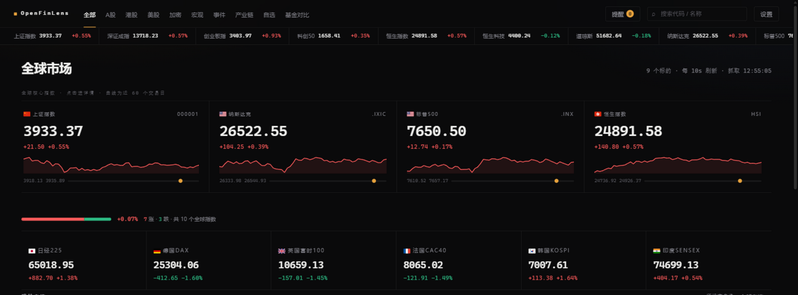

<div align="center">

# 🔭 OpenFinLens

**零依赖、零密钥、零服务器的全球金融看板。**
*A market dashboard with zero dependencies, zero API keys and zero backend — it lives in your browser.*

**[线上体验 · Live Demo →](https://5777-wq.github.io/openfinlens/)**




</div>

## 这是什么

信息本来都是免费的——行情、龙虎榜、南向资金、全球事件，全躺在各家免费公开接口里。收费的是把它们凑到同一块屏幕上（参考价：Bloomberg Terminal，一年三万美元上下）。

这个项目选择在**你的浏览器里**把它们直接抓回来拼成一块屏幕：没有服务器，没有数据库，没有构建，也没有 `node_modules`。克隆下来，双击 `index.html`，它就活了。

## 快速开始

```bash
git clone https://github.com/5777-wq/openfinlens.git
cd openfinlens
# 安装步骤：双击 index.html。就这。（所有数据源 CORS 全通，file:// 也能跑）
# 或者起个本地服务器：
python -m http.server 8765   # → http://127.0.0.1:8765
```

## 它能做什么

### 🗺️ 一屏读完 5000 只股票

A股 5000+ 只、港股 ~2900、美股 ~13800、加密 80 币，全市场热力图直接手写 squarify + Canvas 画出来：滚轮以光标为锚缩放、拖拽平移、双指捏合。哪个板块涨疯了，一眼就知道——不用开 VIP。


### ⚡ 全球大事，落在地图上、钉在 K 线上

GDELT + 新浪 7x24 每 5 分钟采集，按类别落点在自绘世界地图上（不依赖任何地图服务）；事件和龙虎榜还会按日期画上 K 线，点一下就能看到「消息出来的那天，价格发生了什么」。


### 还有这些

- **💰 披露类资金** —— 龙虎榜与席位 90 天档案（A股）、伯克希尔/桥水/ARK/Pershing 的 13F（美股）、南向持股（港股）。只看监管要求披露的，发言 ≠ 交易，口径分开；
- **🆚 基金对比** —— 最多 8 只标的同轴对比：后复权价（含分红）归一化曲线、收益 / 回撤 / 夏普 / 年度矩阵 / 相关性矩阵，最长回到 2006 年；复制地址就是分享。拿不到含分红口径时明确标注「价格收益」，绝不糊弄；
- **🧪 技术面 + 情绪** —— RSI / MACD / KDJ / BOLL 全部日K手算、附读法；各市场温度计、涨跌家数、七段分布。全是统计口径，一个「买入」都不说；
- **📺 产业链 + 热门概念** —— 10 条链 · 49 环节 · 163 只成分股，环节强度实时计算；东财 500+ 概念板块榜一键跳转；
- **🌍 世界经济** —— 世界银行 API，美中日德英法印韩 × 六项宏观指标，色阶热图；
- **⭐ 自选与搜索** —— 跨市场收藏、中文 / 代码 / 拼音搜索、键盘切 tab、hash 深链；
- **🛟 永不白屏** —— 主源挂了走备源，备源挂了走缓存，最差也是「降级角标 + 旧数据」，绝不弹窗报错。

宽屏 ≥1280px 自动两栏密排，10 秒轮询，红涨绿跌可切换。

## 它怎么工作

```
浏览器（纯客户端）
├── sources/  每类数据一个适配器：主源 ──失败──▶ 备源 ──失败──▶ localStorage 缓存
├── app.js    轮询调度（setTimeout 链）→ 增量 patch DOM，不整墙重建
├── treemap/charts/technical/events/compare  纯函数计算层，全部可单测
└── worldmap + bus  地图 ↔ K线 ↔ 资金，事件总线联动
```

海外源（GDELT / SEC EDGAR / Polymarket）不在浏览器里请求：GitHub Actions 定时抓取、清洗后提交一份静态 JSON，浏览器只读自己的数据——你不需要能直连海外接口。Polymarket 只提取「事件概率」一个数字，无链接、无交易入口。

## 数据源 · 全部免密钥

| 品类 | 主源 | 备源 |
|---|---|---|
| A股 / 港股 / 美股 / 指数 | 腾讯 | 东财 |
| 全市场热力图（A/港/美） | 东财 `clist` 分页并发 | — |
| 加密 | 币安 | OKX |
| K线 / 长历史 | 腾讯 `ifzq` / 东财 `push2his`（含分红） | 熔断后腾讯兜底（标注口径） |
| 全球事件 / 事件概率 / 13F | GDELT + 新浪 / Polymarket / SEC → Actions 采集 | 静态 JSON |
| 外汇 / 商品 / 宏观 / 新闻 | 东财 secid / 世界银行 / 新浪 roll | 缓存 |

## 部署 · 安卓 · 测试

**自己部署**：push 到你的 GitHub 仓库 → Settings → Pages → `Deploy from a branch` → 一分钟后就有自己的地址（`.nojekyll` 已备好）。

**安卓版**：`android/` 是 WebView 壳工程（无 Gradle 也能构建），`cd android && bash build.sh`；只申请 `INTERNET` 一个权限，签名 APK 在 [Releases](https://github.com/5777-wq/openfinlens/releases)。

**测试**：`node _test/run-all.mjs`（20 组 250 条断言）或 `--offline`（14 组 169 条，断网可跑，已挂 CI）。技术指标有构造序列对账，降级链逐条改坏主源实测。

## 免责声明

仅供学习与技术研究，**不构成投资建议**。数据来自第三方公开接口，有延迟、会出错；据此交易，后果自负。

---

<div align="center">

**技术栈：** 原生 HTML/CSS/JS · [lightweight-charts](https://github.com/tradingview/lightweight-charts)（vendored）· d3-geo / topojson（vendored）· 手写 squarify

*如果它帮你省了一笔行情软件订阅费，star 就当是咖啡钱。* ☕
*实现细节与接口踩坑记录：[docs/FIELD-NOTES.md](docs/FIELD-NOTES.md)*

</div>
