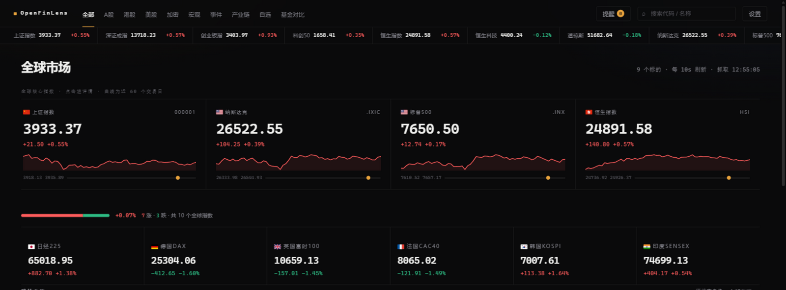
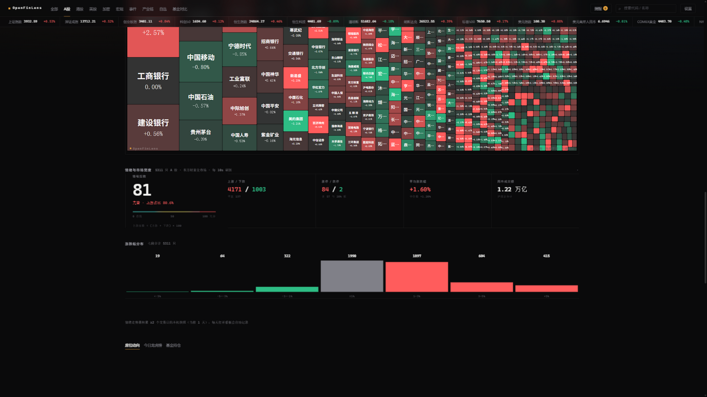
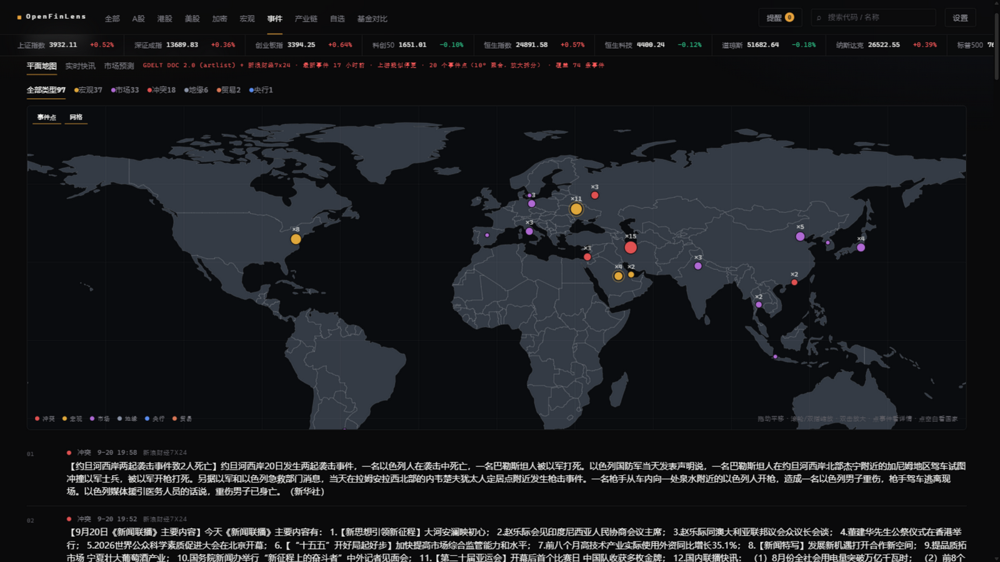

<div align="center">

# 🔭 OpenFinLens

**A股、港股、美股、加密、全球事件，一块屏幕读完的纯前端行情终端。**

没有后端，没有 API key，没有构建。clone 下来双击 `index.html`，它就跑起来了。

**[线上体验 →](https://5777-wq.github.io/openfinlens/)**　·　**[下载安卓 APK](https://github.com/5777-wq/openfinlens/releases)**

[](LICENSE)
[](https://github.com/5777-wq/openfinlens/releases)




</div>

## 为什么有这个项目

行情、龙虎榜、南向资金、全球事件，这些数据本来都是免费的，躺在各家公开接口里。收费的是把它们拼到同一块屏幕上——参考价：Bloomberg Terminal，一年三万美元上下。

OpenFinLens 在你的浏览器里直接把数据抓回来、拼成一块屏幕，所有计算都在你自己的机器上完成，连 `node_modules` 都没有。

## 功能

### 全市场热力图

A股 5000+、港股约 2900、美股约 13800、加密 80 币种，全市场热力图用手写的 squarify 布局加 Canvas 渲染：滚轮以光标为锚缩放，拖拽平移，双指捏合。哪个板块涨疯了，一眼看到，不用开 VIP。



### 全球事件，钉在地图和 K 线上

GDELT + 新浪 7x24 每 5 分钟采集一次，按类别落在自绘世界地图上，不依赖任何地图服务。事件和龙虎榜还会按日期画进 K 线：点一下，就能看到消息公布那天，价格发生了什么。



### 其他模块

| 模块 | 能做什么 |
|---|---|
| 披露类资金 | A股龙虎榜与席位 90 天档案；美股 13F 持仓（伯克希尔、桥水、ARK、Pershing）；港股南向持股。只收录监管要求披露的数据，发言 ≠ 交易，口径分开 |
| 基金对比 | 最多 8 只标的后复权价归一化对比，收益、最大回撤、夏普、年度矩阵、相关性矩阵，历史最长回到 2006 年。拿不到含分红口径时明确标注「价格收益」，绝不糊弄 |
| 技术面与情绪 | RSI / MACD / KDJ / BOLL 按日 K 手算，附读法；各市场温度计、涨跌家数、七段分布。只算统计口径，不给买卖建议 |
| 产业链与概念 | 10 条产业链、49 个环节、163 只成分股，环节强度实时计算；东财 500+ 概念板块榜一键跳转 |
| 世界经济 | 世界银行 API：美中日德英法印韩 × 六项宏观指标，色阶热图 |
| 自选与搜索 | 跨市场收藏，中文 / 代码 / 拼音搜索，键盘切换 tab，URL 即分享 |
| 降级策略 | 主源失败走备源，备源失败走 localStorage 缓存，最差情况是「降级角标 + 旧数据」，不弹窗报错 |

宽屏（≥1280px）自动两栏密排，行情 10 秒轮询，红涨绿跌可切换。

## 快速开始

**在线用**：打开 [5777-wq.github.io/openfinlens](https://5777-wq.github.io/openfinlens/) 即可，支持 PWA 安装到桌面。

**本地跑**：

```bash
git clone https://github.com/5777-wq/openfinlens.git
cd openfinlens
# 双击 index.html 就能用——所有数据源 CORS 全通，file:// 也能跑
# 或者起个本地服务器：
python -m http.server 8765   # → http://127.0.0.1:8765
```

**手机**：

- **Android**：[Releases](https://github.com/5777-wq/openfinlens/releases) 里有签名 APK（v1.0.2），只申请 `INTERNET` 一个权限。源码在 `android/`，无 Gradle 也能构建：`cd android && bash build.sh`。
- **微信小程序**：`miniprogram/` 是 web-view 壳工程，需要非个人主体和已备案域名，完整门槛与步骤见 [docs/MINIPROGRAM.md](docs/MINIPROGRAM.md)。

## 数据源

全部免密钥：

| 品类 | 主源 | 备源 |
|---|---|---|
| A股 / 港股 / 美股 / 指数 | 腾讯 | 东财 |
| 全市场热力图（A/港/美） | 东财 `clist` 分页并发 | — |
| 加密 | 币安 | OKX |
| K线 / 长历史 | 腾讯 `ifzq` / 东财 `push2his`（含分红） | 熔断后腾讯兜底（标注口径） |
| 全球事件 / 事件概率 / 13F | GDELT + 新浪 / Polymarket / SEC → Actions 采集 | 静态 JSON |
| 外汇 / 商品 / 宏观 / 新闻 | 东财 secid / 世界银行 / 新浪 roll | 缓存 |

## 它怎么工作

```
浏览器（纯客户端）
├── sources/  每类数据一个适配器：主源 ──失败──▶ 备源 ──失败──▶ localStorage 缓存
├── app.js    轮询调度（setTimeout 链）→ 增量 patch DOM，不整墙重建
├── treemap/charts/technical/events/compare  纯函数计算层，全部可单测
└── worldmap + bus  地图 ↔ K线 ↔ 资金，事件总线联动
```

海外源（GDELT / SEC EDGAR / Polymarket）不在浏览器里请求：GitHub Actions 定时抓取、清洗后把静态 JSON 提交进仓库，浏览器只读仓库里的数据。所以你不需要能直连海外接口。Polymarket 只提取「事件概率」一个数字，无链接、无交易入口。

采集受 GitHub Actions 调度延迟影响时，可以把 cron 搬到自己服务器上，见 [docs/SERVER-COLLECT.md](docs/SERVER-COLLECT.md)。

## 自部署

push 到你的 GitHub 仓库 → Settings → Pages → `Deploy from a branch`，一分钟后就有自己的地址（`.nojekyll` 已备好）。

默认所有源都直连。如果部署环境访问不到币安 / OKX，或想启用新浪源，可以部署一个 Cloudflare Worker 代理补 Referer / UA：`wrangler deploy worker.js`，仅此一处是可选项。

## 测试

```bash
node _test/run-all.mjs           # 20 组 250 条断言（含联网组）
node _test/run-all.mjs --offline # 14 组 169 条，断网可跑，已挂 CI
```

技术指标有构造序列对账；降级链是逐条改坏主源实测的，不是纸面设计。

## 常见问题

**数据是实时的吗？**
不是。全部来自第三方免费公开接口，有延迟、会出错，仅供研究参考（见下方免责声明）。

**在国内能用吗？**
能。行情主源是腾讯和东财，国内直连；海外源已经转成仓库里的静态 JSON，浏览器不请求 GDELT / SEC / Polymarket。

**会上传我的任何数据吗？**
不会。没有后端，没有统计埋点，自选和缓存都存在你浏览器的 localStorage 里。

**红涨绿跌反了？**
设置里可以切换。

## 免责声明

仅供学习与技术研究，**不构成投资建议**。数据来自第三方公开接口，有延迟、会出错；据此交易，后果自负。

## License

[MIT](LICENSE)

---

<div align="center">

**技术栈：** 原生 HTML/CSS/JS · [lightweight-charts](https://github.com/tradingview/lightweight-charts)（vendored）· d3-geo / topojson（vendored）· 手写 squarify

实现细节与接口踩坑：[docs/FIELD-NOTES.md](docs/FIELD-NOTES.md)　·　架构设计：[docs/ARCHITECTURE.md](docs/ARCHITECTURE.md)

*如果它帮你省了一笔行情软件订阅费，star 就当是咖啡钱。* ☕

</div>
